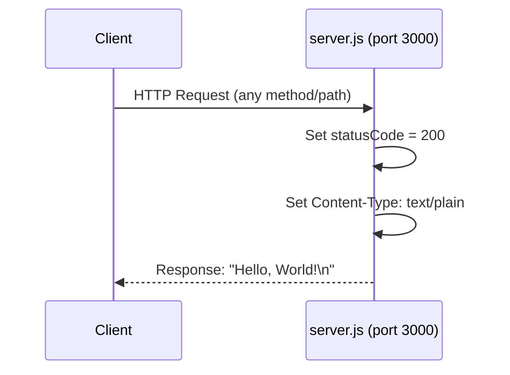
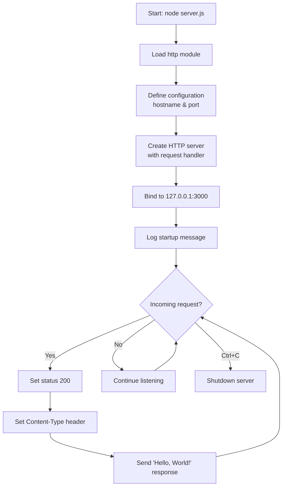

# Hello World Server

[](https://nodejs.org/)
[](https://opensource.org/licenses/MIT)
[](package.json)

A minimal HTTP server implementation in Node.js that responds with "Hello, World!" to all requests.

---

## Table of Contents

- [Overview](#overview)
- [Prerequisites](#prerequisites)
- [Installation](#installation)
- [Quick Start](#quick-start)
- [API Reference](#api-reference)
- [Configuration](#configuration)
- [Deployment Guide](#deployment-guide)
- [Project Structure](#project-structure)
- [Troubleshooting](#troubleshooting)
- [Code Explanation](#code-explanation)
- [Contributing](#contributing)
- [License](#license)

---

## Overview

**Hello World Server** is a minimal HTTP server built using Node.js's built-in `http` module. It demonstrates the fundamental concepts of creating a web server without any external dependencies.

### Key Features

- **Zero Dependencies**: Uses only Node.js built-in modules
- **Minimal Footprint**: Single file implementation (~15 lines of code)
- **Universal Response**: Returns "Hello, World!" for any HTTP method and path
- **Easy to Understand**: Perfect for learning HTTP server basics

### Purpose

This project serves as:
- A learning resource for Node.js HTTP server fundamentals
- A test fixture for integration testing and validation
- A minimal template for building more complex servers

> **Historical Note**: This repository was originally created as a test project for Backprop integration validation ("hao-backprop-test").

---

## Prerequisites

Before running this server, ensure you have the following installed:

| Requirement | Minimum Version | Recommended Version |
|-------------|-----------------|---------------------|
| Node.js     | Any modern version | 20.x LTS |
| npm         | 6.x | 10.x+ |

### Verify Node.js Installation

```bash
node --version
# Expected output: v20.x.x or similar

npm --version
# Expected output: 10.x.x or similar
```

If Node.js is not installed, download it from [nodejs.org](https://nodejs.org/).

---

## Installation

### Option 1: Clone the Repository

```bash
# Clone the repository
git clone <repository-url>
cd <repository-name>
```

### Option 2: Download Files

Download `server.js` and `package.json` to your local directory.

### Verify Setup

After obtaining the files, verify the structure:

```bash
ls -la
# Should show: server.js, package.json, README.md, etc.
```

No additional installation steps are required since this project has **zero external dependencies**.

---

## Quick Start

### Start the Server

```bash
node server.js
```

### Expected Output

```
Server running at http://127.0.0.1:3000/
```

### Test the Server

Open a new terminal and run:

```bash
curl http://127.0.0.1:3000/
```

**Expected Response:**
```
Hello, World!
```

### Stop the Server

Press `Ctrl+C` in the terminal where the server is running.

---

## API Reference

### Endpoint Overview

| Method | Path | Status Code | Content-Type | Response Body |
|--------|------|-------------|--------------|---------------|
| ANY    | ANY  | 200 OK      | text/plain   | `Hello, World!\n` |

The server responds identically to **all HTTP methods** (GET, POST, PUT, DELETE, etc.) and **all URL paths**.

### Request Format

The server accepts any valid HTTP request. No specific headers, body, or parameters are required.

### Response Format

| Field | Value |
|-------|-------|
| Status Code | `200` |
| Content-Type | `text/plain` |
| Body | `Hello, World!\n` |

### Example Requests

#### Using curl

```bash
# Basic GET request
curl http://127.0.0.1:3000/

# GET request with verbose output
curl -v http://127.0.0.1:3000/

# POST request (same response)
curl -X POST http://127.0.0.1:3000/

# Request to any path (same response)
curl http://127.0.0.1:3000/any/path/here
```

#### Using a Web Browser

Open your browser and navigate to:
```
http://127.0.0.1:3000/
```

You will see the text "Hello, World!" displayed in the browser window.

#### Programmatic Access (Node.js)

```javascript
const http = require('http');

http.get('http://127.0.0.1:3000/', (res) => {
  let data = '';
  res.on('data', chunk => data += chunk);
  res.on('end', () => console.log(data)); // Output: Hello, World!
});
```

### Request/Response Flow



---

## Configuration

The server configuration is defined by two constants in `server.js`:

| Constant | Default Value | Description | Source |
|----------|---------------|-------------|--------|
| `hostname` | `'127.0.0.1'` | IP address the server binds to (localhost only) | server.js:3 |
| `port` | `3000` | TCP port the server listens on | server.js:4 |

### Modifying Configuration

To change the server binding, edit the constants in `server.js`:

```javascript
// server.js lines 3-4
const hostname = '0.0.0.0';  // Bind to all interfaces (for external access)
const port = 8080;           // Use a different port
```

### Configuration Options Explained

| Setting | Value | Use Case |
|---------|-------|----------|
| `127.0.0.1` | Localhost only | Development, security (default) |
| `0.0.0.0` | All network interfaces | Allow external connections |
| `::` | IPv6 all interfaces | IPv6 networks |

---

## Deployment Guide

### Local Development

For local development and testing:

```bash
# Start the server
node server.js

# The server runs in the foreground
# Press Ctrl+C to stop
```

### Running in Background

#### Using nohup (Linux/macOS)

```bash
nohup node server.js > server.log 2>&1 &
echo $! > server.pid

# To stop:
kill $(cat server.pid)
```

#### Using PM2 (Recommended for Production)

```bash
# Install PM2 globally
npm install -g pm2

# Start the server
pm2 start server.js --name "hello-world"

# View status
pm2 status

# View logs
pm2 logs hello-world

# Stop the server
pm2 stop hello-world
```

### Production Considerations

For production deployments, consider:

1. **Process Management**: Use PM2, systemd, or Docker for automatic restarts
2. **Reverse Proxy**: Place behind nginx or Apache for TLS termination
3. **Port Configuration**: Change from port 3000 to 80/443 or use a reverse proxy
4. **Binding Address**: Change hostname from `127.0.0.1` to `0.0.0.0` for external access
5. **Logging**: Implement proper logging instead of console.log
6. **Health Checks**: Add a dedicated health check endpoint

### Docker Deployment (Optional)

Create a `Dockerfile`:

```dockerfile
FROM node:20-alpine
WORKDIR /app
COPY server.js .
EXPOSE 3000
CMD ["node", "server.js"]
```

Build and run:

```bash
docker build -t hello-world-server .
docker run -p 3000:3000 hello-world-server
```

---

## Project Structure

```
.
├── server.js              # Main HTTP server implementation
├── server - Copy.js       # Duplicate of server.js (backup/variant)
├── package.json           # npm package configuration
├── package-lock.json      # npm dependency lock file
├── README.md              # Project documentation (this file)
├── LoginTest.java         # Java test stub (placeholder)
├── LoginTest - Copy.java  # Java test stub copy (placeholder)
├── industry.csv           # Industry taxonomy data (43 values)
├── industry - Copy.csv    # Industry taxonomy copy
├── test.py.txt            # Empty placeholder file
├── test.py - Copy.txt     # Empty placeholder file
└── test.txt.txt           # Empty placeholder file
```

### File Descriptions

| File | Purpose |
|------|---------|
| `server.js` | Primary HTTP server - the main executable |
| `server - Copy.js` | Backup copy of server.js with identical functionality |
| `package.json` | Defines project metadata (name, version, author, license) |
| `package-lock.json` | Locks dependency versions (currently empty deps) |
| `README.md` | Comprehensive project documentation |
| `*.java` | Java test stubs (non-compilable placeholders) |
| `*.csv` | Industry taxonomy data fixtures |
| `*.txt` | Empty placeholder/sentinel files |

---

## Troubleshooting

### Port 3000 Already in Use

**Error:**
```
Error: listen EADDRINUSE: address already in use 127.0.0.1:3000
```

**Solutions:**

1. Find and kill the process using port 3000:
   ```bash
   # Linux/macOS
   lsof -i :3000
   kill <PID>
   
   # Windows
   netstat -ano | findstr :3000
   taskkill /PID <PID> /F
   ```

2. Use a different port by editing `server.js`:
   ```javascript
   const port = 3001;  // or any available port
   ```

### Node.js Not Found

**Error:**
```
bash: node: command not found
```

**Solutions:**

1. Install Node.js from [nodejs.org](https://nodejs.org/)
2. If installed, add Node.js to your PATH:
   ```bash
   # Check installation location
   which node  # Linux/macOS
   where node  # Windows
   ```

### Connection Refused

**Error:**
```
curl: (7) Failed to connect to 127.0.0.1 port 3000: Connection refused
```

**Solutions:**

1. Verify the server is running:
   ```bash
   ps aux | grep node  # Linux/macOS
   tasklist | findstr node  # Windows
   ```

2. Ensure you're connecting to the correct address and port
3. Check firewall settings are not blocking port 3000

### Cannot Access from External Machine

**Problem:** Server only accessible from localhost

**Solution:** Change hostname from `127.0.0.1` to `0.0.0.0`:
```javascript
const hostname = '0.0.0.0';  // Allows external connections
```

---

## Code Explanation

The `server.js` file implements a minimal HTTP server in just 14 lines of code. Here's a detailed walkthrough:

### Line-by-Line Breakdown

```javascript
// Line 1: Import the built-in Node.js HTTP module
const http = require('http');

// Line 3: Define the hostname (IP address) to bind to
// '127.0.0.1' means localhost only - not accessible from other machines
const hostname = '127.0.0.1';

// Line 4: Define the TCP port number to listen on
const port = 3000;

// Lines 6-10: Create the HTTP server with a request handler callback
const server = http.createServer((req, res) => {
  // Line 7: Set HTTP status code to 200 (OK)
  res.statusCode = 200;
  
  // Line 8: Set the Content-Type header to plain text
  res.setHeader('Content-Type', 'text/plain');
  
  // Line 9: Send the response body and end the response
  res.end('Hello, World!\n');
});

// Lines 12-14: Start the server listening on the specified host and port
server.listen(port, hostname, () => {
  // Line 13: Log a message when the server starts successfully
  console.log(`Server running at http://${hostname}:${port}/`);
});
```

### Server Lifecycle Diagram



### Key Concepts

| Concept | Explanation |
|---------|-------------|
| `require('http')` | Imports Node.js built-in HTTP module (CommonJS syntax) |
| `http.createServer()` | Factory function that creates an HTTP server instance |
| Request handler | Callback function `(req, res) => {...}` executed for each request |
| `res.statusCode` | Sets the HTTP response status code |
| `res.setHeader()` | Sets an HTTP response header |
| `res.end()` | Sends the response body and completes the response |
| `server.listen()` | Starts the server on specified port and hostname |

---

## Contributing

Contributions are welcome! Here's how you can help:

1. **Fork** the repository
2. **Create** a feature branch (`git checkout -b feature/improvement`)
3. **Commit** your changes (`git commit -am 'Add new feature'`)
4. **Push** to the branch (`git push origin feature/improvement`)
5. **Open** a Pull Request

### Guidelines

- Maintain the minimal, zero-dependency nature of the project
- Follow existing code style and conventions
- Update documentation for any changes
- Test your changes before submitting

---

## License

This project is licensed under the **MIT License**.

```
MIT License

Copyright (c) hxu

Permission is hereby granted, free of charge, to any person obtaining a copy
of this software and associated documentation files (the "Software"), to deal
in the Software without restriction, including without limitation the rights
to use, copy, modify, merge, publish, distribute, sublicense, and/or sell
copies of the Software, and to permit persons to whom the Software is
furnished to do so, subject to the following conditions:

The above copyright notice and this permission notice shall be included in all
copies or substantial portions of the Software.

THE SOFTWARE IS PROVIDED "AS IS", WITHOUT WARRANTY OF ANY KIND, EXPRESS OR
IMPLIED, INCLUDING BUT NOT LIMITED TO THE WARRANTIES OF MERCHANTABILITY,
FITNESS FOR A PARTICULAR PURPOSE AND NONINFRINGEMENT. IN NO EVENT SHALL THE
AUTHORS OR COPYRIGHT HOLDERS BE LIABLE FOR ANY CLAIM, DAMAGES OR OTHER
LIABILITY, WHETHER IN AN ACTION OF CONTRACT, TORT OR OTHERWISE, ARISING FROM,
OUT OF OR IN CONNECTION WITH THE SOFTWARE OR THE USE OR OTHER DEALINGS IN THE
SOFTWARE.
```

---

<sub>**Source Citations:** README.md (original title), server.js (lines 1-14), package.json (metadata: name="hello_world", version="1.0.0", author="hxu", license="MIT")</sub>
