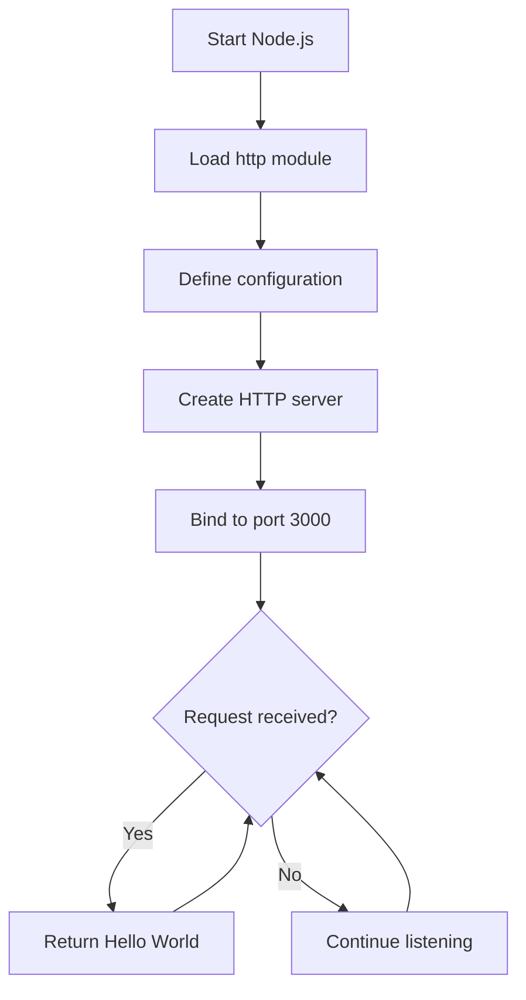
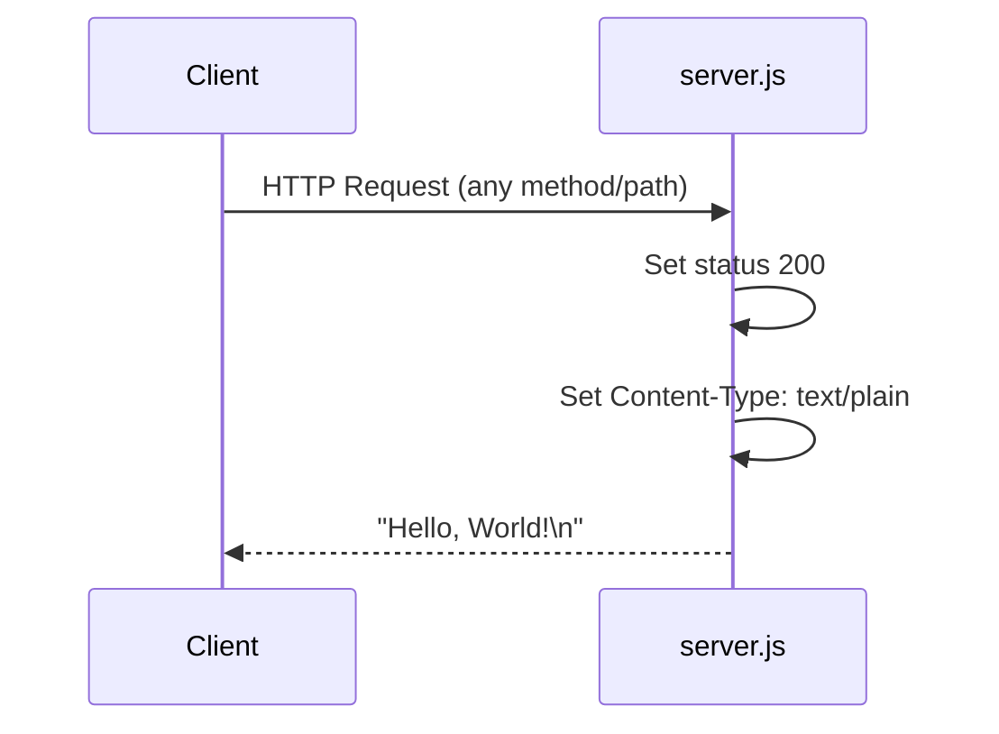

# Technical Specification

# 0. Agent Action Plan

## 0.1 Intent Clarification

### 0.1.1 Core Documentation Objective

Based on the provided requirements, the Blitzy platform understands that the documentation objective is to **comprehensively document a minimal Node.js HTTP server** by adding JSDoc inline comments and creating a complete README with multiple documentation sections.

**Request Categorization:** Create new documentation + Update existing documentation

**Documentation Types Required:**
- API Documentation (JSDoc comments for server.js functions)
- User Guide (README setup instructions)
- Technical Reference (API documentation section)
- Deployment Guide (standalone deployment section)
- Code Explanations (inline comments throughout server.js)

**Explicit Requirements:**

| Requirement | Documentation Deliverable | Priority |
|------------|---------------------------|----------|
| Add JSDoc comments to server.js functions | JSDoc blocks for constants, server creation callback, and listen callback | High |
| Create comprehensive README | Complete README.md overhaul | High |
| Setup instructions | README section detailing environment setup and running the server | High |
| API documentation | README section documenting HTTP endpoint behavior | High |
| Deployment guide | README section with deployment options and instructions | High |
| Inline code explanations | Line-by-line comments explaining each code section | High |

**Implicit Documentation Needs Identified:**

- **Configuration Documentation**: Document the `hostname` and `port` constants
- **Prerequisites Section**: Node.js runtime requirement documentation
- **Troubleshooting Guide**: Common issues like port conflicts
- **Code Structure Overview**: Explain the server architecture pattern
- **Response Behavior**: Document the static "Hello, World!" response across all endpoints

### 0.1.2 Special Instructions and Constraints

**User Directives Captured:**
- JSDoc comments must be added to **all** server.js functions (request handler callback, listen callback)
- README must be **comprehensive** (implies thorough coverage, not minimal)
- README must contain **distinct sections** for setup, API docs, deployment, and code explanations
- Code explanations must be **inline** (within source files, not in separate documentation)

**Template Requirements:**
- No specific template provided by user
- Follow standard JSDoc syntax and conventions
- README should follow common open-source project documentation patterns

**Style Preferences:**
- Professional, clear documentation tone appropriate for a development environment
- Technical accuracy with accessible explanations
- Structured sections with clear navigation

**Preservation Note:** The existing README.md contains a warning "test project for backprop integration. Do not touch!" - this context should be preserved/acknowledged in the new documentation.

### 0.1.3 Technical Interpretation

These documentation requirements translate to the following technical documentation strategy:

**server.js Documentation Strategy:**

- To document the HTTP module import, we will add a JSDoc `@file` block at the top of server.js describing the module purpose
- To document configuration constants, we will add JSDoc `@constant` annotations for `hostname` and `port`
- To document the request handler, we will add a JSDoc block describing the callback function's parameters (`req`, `res`) and behavior
- To document the server listen callback, we will add a JSDoc block describing the startup notification function
- To provide inline explanations, we will add single-line comments explaining each code section

**README.md Documentation Strategy:**

- To create setup instructions, we will add a "Getting Started" section with prerequisites, installation, and execution steps
- To create API documentation, we will add an "API Reference" section documenting endpoint behavior, request/response formats
- To create a deployment guide, we will add a "Deployment" section with local and production deployment options
- To provide code explanations, we will add a "Code Structure" section with annotated code walkthrough

### 0.1.4 Inferred Documentation Needs

**Based on code analysis:**
- The `server.js` contains zero JSDoc comments currently - complete documentation needed
- The `http.createServer()` callback handles all HTTP methods and paths identically - requires clear API documentation
- Server binds to `127.0.0.1:3000` - configuration limitations should be documented

**Based on structure:**
- Flat repository with no subdirectories - documentation structure should be simple
- `package.json` exists but defines no start script - npm run scripts should be documented as enhancement opportunity
- `server - Copy.js` duplicate exists - relationship should be noted in documentation

**Based on dependencies:**
- Zero external dependencies (Node.js built-in `http` only) - simplifies prerequisite documentation
- CommonJS module system used - import pattern should be documented

**Based on user journey:**
- New users need to: (1) install Node.js, (2) clone/download repo, (3) run server, (4) test endpoint
- Documentation must guide users through this complete journey
- Troubleshooting for common issues (port in use, Node.js not installed) should be included

## 0.2 Documentation Discovery and Analysis

### 0.2.1 Existing Documentation Infrastructure Assessment

Repository analysis was conducted using comprehensive file discovery patterns to identify all existing documentation assets.

**Search Patterns Employed:**
- `README*` - Found: `README.md`
- `docs/**` - Found: None (no docs directory exists)
- `*.md` - Found: `README.md` only
- `*.rst` - Found: None
- `wiki/**` - Found: None
- `CONTRIBUTING*`, `CHANGELOG*`, `LICENSE*` - Found: None

**Repository Analysis Findings:**

"Repository analysis reveals a **minimal documentation structure** with **critical coverage gaps**. The existing README.md contains only 2 lines with a project title and a warning notice, providing no functional documentation for developers."

**Current Documentation Inventory:**

| File | Location | Status | Content Summary |
|------|----------|--------|-----------------|
| README.md | Root | Exists (minimal) | Title "hao-backprop-test" + warning "Do not touch!" |
| JSDoc in server.js | Root | Missing | Zero JSDoc comments present |
| JSDoc in server - Copy.js | Root | Missing | Zero JSDoc comments present |
| Code comments | server.js | Missing | No inline comments exist |

**Documentation Framework Assessment:**

| Component | Status | Details |
|-----------|--------|---------|
| Documentation Generator | Not configured | No mkdocs.yml, docusaurus.config.js, or sphinx.conf.py found |
| API Documentation Tools | Not configured | No JSDoc configuration (jsdoc.json) found |
| Diagram Tools | Not configured | No Mermaid or PlantUML setup |
| Documentation Hosting | Not configured | No GitHub Pages, ReadTheDocs, or similar setup |

### 0.2.2 Repository Code Analysis for Documentation

**Code Files Requiring Documentation:**

| File | Type | Functions/Elements | Documentation Status |
|------|------|-------------------|---------------------|
| server.js | JavaScript | Module import, 2 constants, 1 request handler callback, 1 listen callback | Undocumented |
| server - Copy.js | JavaScript | Duplicate of server.js | Undocumented |
| package.json | JSON Config | Package metadata | Self-documenting (JSON) |

**server.js Detailed Analysis:**

```
Line 1: const http = require('http');        → Module import, needs @file documentation
Line 3: const hostname = '127.0.0.1';        → Constant, needs @constant JSDoc
Line 4: const port = 3000;                   → Constant, needs @constant JSDoc
Lines 6-10: http.createServer callback       → Request handler, needs @callback JSDoc
Lines 12-14: server.listen callback          → Startup notification, needs @callback JSDoc
```

**Key Directories Examined:**
- Root directory (only directory - flat structure)

**Related Documentation Found:**
- `package.json` contains metadata: name="hello_world", description="Hello world in Node.js", author="hxu", license="MIT"
- Technical specification documents exist with detailed component analysis

### 0.2.3 Web Search Research Conducted

**Best Practices Research Results:**

| Topic Researched | Key Findings Applied |
|------------------|---------------------|
| JSDoc comments for Node.js | Use `/** */` blocks, `@param`, `@returns`, `@constant`, `@file` tags |
| JSDoc for HTTP callbacks | Document `req` and `res` parameters with IncomingMessage and ServerResponse types |
| README structure conventions | Include badges, overview, prerequisites, installation, usage, API reference, deployment, contributing |
| HTTP server documentation | Document endpoint behavior, supported methods, response format, status codes |

**Documentation Standards Adopted:**
- JSDoc 3 syntax for inline code documentation
- CommonMark Markdown for README
- Mermaid diagrams for architectural visualization
- Table format for API endpoint documentation

## 0.3 Documentation Scope Analysis

### 0.3.1 Code-to-Documentation Mapping

**Module: server.js (Primary Documentation Target)**

| Element | Type | Line(s) | Current Documentation | Documentation Needed |
|---------|------|---------|----------------------|---------------------|
| File header | Module | 1 | Missing | `@file` JSDoc block describing module purpose |
| `http` import | Require | 1 | Missing | Inline comment explaining Node.js http module |
| `hostname` | Constant | 3 | Missing | `@constant` JSDoc with type and purpose |
| `port` | Constant | 4 | Missing | `@constant` JSDoc with type and purpose |
| `http.createServer` callback | Function | 6-10 | Missing | Full JSDoc with `@callback`, `@param`, description |
| `server.listen` callback | Function | 12-14 | Missing | JSDoc with callback description |

**Public APIs (HTTP Endpoint):**

| Endpoint | Method | Path | Current Docs | Required Docs |
|----------|--------|------|--------------|---------------|
| HTTP Server | ANY | ANY (wildcard) | None | Full API reference with request/response examples |

**Configuration Options:**

| Config Element | File | Current Docs | Required Docs |
|----------------|------|--------------|---------------|
| hostname | server.js:3 | None | Document binding address and modification options |
| port | server.js:4 | None | Document port number and how to change |
| Package metadata | package.json | Self-documenting | Reference in README |

**Features Requiring User Guides:**

| Feature | Current Coverage | Documentation Gaps |
|---------|-----------------|-------------------|
| Server startup | None | How to start, expected output |
| HTTP response | None | What response is returned, format |
| Server shutdown | None | How to stop the server (Ctrl+C) |

### 0.3.2 Documentation Gap Analysis

Given the requirements and repository analysis, documentation gaps include:

**Critical Gaps (Must Address):**

| Gap Category | Specific Gap | Impact |
|--------------|-------------|--------|
| JSDoc Comments | Zero JSDoc blocks in server.js | Cannot generate API docs, no IDE intellisense |
| README Content | Only 2 lines exist, no setup/usage info | New users cannot use the project |
| Inline Comments | No code explanations | Code purpose unclear to maintainers |
| API Documentation | HTTP endpoint undocumented | Users don't know how to interact with server |
| Deployment Guide | No deployment instructions | Users cannot deploy to any environment |

**Undocumented Public APIs:**

- `http.createServer()` callback function (request handler)
- `server.listen()` callback function (startup notification)
- HTTP endpoint `ANY http://127.0.0.1:3000/*`

**Missing User Guides:**

- Prerequisites and environment setup
- Installation instructions  
- Running the server
- Testing the endpoint (curl/browser examples)
- Stopping the server
- Troubleshooting common issues

**Incomplete Architecture Documentation:**

- Server lifecycle not documented
- Request/response flow not documented
- Configuration management not explained

**Outdated Documentation:**

- README.md contains project name "hao-backprop-test" which may need updating to "hello_world" per package.json
- Warning "Do not touch!" needs context or removal

### 0.3.3 Documentation Completeness Matrix

| Documentation Area | Current State | Target State | Gap Size |
|-------------------|---------------|--------------|----------|
| JSDoc in server.js | 0% | 100% | Full implementation |
| README - Overview | 10% (title only) | 100% | Near-complete rewrite |
| README - Setup | 0% | 100% | Create from scratch |
| README - API Docs | 0% | 100% | Create from scratch |
| README - Deployment | 0% | 100% | Create from scratch |
| Inline Comments | 0% | 100% | Add throughout server.js |

## 0.4 Documentation Implementation Design

### 0.4.1 Documentation Structure Planning

**Target Documentation Hierarchy:**

```
Repository Root/
├── README.md (comprehensive documentation hub)
│   ├── Project Overview
│   ├── Prerequisites
│   ├── Installation
│   ├── Quick Start
│   ├── API Reference
│   ├── Configuration
│   ├── Deployment Guide
│   ├── Project Structure
│   ├── Troubleshooting
│   └── License
├── server.js (with JSDoc + inline comments)
│   ├── @file block (module description)
│   ├── @constant blocks (hostname, port)
│   ├── @callback block (request handler)
│   ├── @callback block (listen callback)
│   └── Inline explanatory comments
└── package.json (reference for metadata)
```

### 0.4.2 Content Generation Strategy

**Information Extraction Approach:**

| Source | Information to Extract | Target Documentation |
|--------|----------------------|---------------------|
| server.js:1 | http module import | JSDoc @file, inline comment |
| server.js:3-4 | Configuration constants | JSDoc @constant blocks |
| server.js:6-10 | Request handler logic | JSDoc @callback, inline comments |
| server.js:12-14 | Server startup logic | JSDoc @callback, inline comments |
| package.json | Project metadata | README project overview |
| Runtime behavior | HTTP response format | README API reference |

**JSDoc Generation Specifications:**

```javascript
// Example JSDoc structure for server.js
/**
 * @file Minimal HTTP server implementation
 * @description Creates a basic HTTP server...
 * @author hxu
 * @license MIT
 */

/**
 * @constant {string} hostname
 * @description Server binding address
 * @default '127.0.0.1'
 */

/**
 * @constant {number} port  
 * @description Server listening port
 * @default 3000
 */
```

**README Section Specifications:**

| Section | Content Source | Format |
|---------|---------------|--------|
| Overview | package.json description + expansion | Prose with badges |
| Prerequisites | Runtime requirements | Bulleted list |
| Installation | Repository setup steps | Numbered steps |
| Quick Start | server.js execution | Code blocks with commands |
| API Reference | HTTP endpoint analysis | Tables + curl examples |
| Configuration | server.js constants | Table with options |
| Deployment | Environment considerations | Subsections by environment |
| Troubleshooting | Common error scenarios | Problem/Solution format |

### 0.4.3 Documentation Standards

**Markdown Formatting Standards:**
- Use `#` for main title, `##` for sections, `###` for subsections
- Code blocks with language specification: ` ```javascript `, ` ```bash `
- Tables for structured information (API endpoints, configuration options)
- Bulleted lists for features, numbered lists for procedures

**JSDoc Comment Standards:**
- Begin all JSDoc blocks with `/**` and end with `*/`
- Use standard tags: `@file`, `@constant`, `@param`, `@returns`, `@callback`, `@description`
- Provide type information in curly braces: `{string}`, `{number}`, `{Object}`
- Include meaningful descriptions for all documented elements

**Inline Comment Standards:**
- Use `//` for single-line explanatory comments
- Place comments on line above the code they describe
- Explain "why" not just "what" where appropriate

**Source Citations:**
- Reference format: `Source: /path/to/file.js:LineNumber`
- All technical details traced to source code

### 0.4.4 Diagram and Visual Strategy

**Mermaid Diagrams to Create:**

| Diagram Type | Purpose | Target Location |
|-------------|---------|-----------------|
| Flowchart | Server lifecycle (start → listen → handle requests) | README Architecture section |
| Sequence Diagram | Request/Response flow | README API Reference section |

**Server Lifecycle Diagram Specification:**



**Request Flow Diagram Specification:**



## 0.5 Documentation File Transformation Mapping

### 0.5.1 File-by-File Documentation Plan

**Documentation Transformation Modes:**
- **CREATE** - Create a new documentation file
- **UPDATE** - Update an existing documentation file
- **DELETE** - Remove an obsolete documentation file
- **REFERENCE** - Use as an example for documentation style and structure

| Target Documentation File | Transformation | Source Code/Docs | Content/Changes |
|---------------------------|----------------|------------------|-----------------|
| README.md | UPDATE | README.md, server.js, package.json | Complete rewrite: add overview, prerequisites, installation, quick start, API reference, configuration, deployment guide, project structure, troubleshooting, license sections |
| server.js | UPDATE | server.js | Add JSDoc comments for @file block, @constant for hostname and port, @callback for request handler and listen callback, plus inline explanatory comments |
| server - Copy.js | UPDATE | server - Copy.js | Add identical JSDoc comments and inline explanations to maintain consistency with server.js |

### 0.5.2 New Documentation Files Detail

No new files are being created. All documentation will be added to existing files through updates.

### 0.5.3 Documentation Files to Update Detail

**server.js - Add JSDoc Comments and Inline Explanations**

```
File: server.js
Type: Source Code with JSDoc Documentation
Transformation: UPDATE

Documentation to Add:
├── Line 0 (new): @file JSDoc block
│   - Module description
│   - Author attribution
│   - License information
│   - Module dependencies
├── Line 1: Inline comment for require statement
├── Line 3: @constant JSDoc for hostname
├── Line 4: @constant JSDoc for port
├── Lines 6-10: @callback JSDoc for request handler
│   - @param {http.IncomingMessage} req
│   - @param {http.ServerResponse} res
│   - Function behavior description
│   - Inline comments for each operation
└── Lines 12-14: Inline comments for listen callback
    - Startup notification explanation

Source Citations: 
- server.js (entire file)
- package.json (metadata for @author, @license)
```

**server - Copy.js - Add Identical JSDoc Comments**

```
File: server - Copy.js
Type: Source Code with JSDoc Documentation  
Transformation: UPDATE

Documentation to Add:
- Identical structure to server.js documentation
- @file block noting this is a copy of server.js
- All @constant and @callback blocks
- All inline explanatory comments

Source Citations:
- server - Copy.js (entire file)
- server.js (documentation template)
```

**README.md - Complete Documentation Overhaul**

```
File: README.md
Type: Project Documentation
Transformation: UPDATE (complete rewrite)

Sections to Create:
├── # Hello World Server
│   └── Project badges and one-line description
├── ## Overview
│   └── Purpose, features, test fixture nature
├── ## Prerequisites
│   └── Node.js requirement, version info
├── ## Installation
│   └── Clone/download, verify Node.js
├── ## Quick Start
│   └── Run command, expected output
├── ## API Reference
│   ├── Endpoint table
│   ├── Request format
│   ├── Response format
│   ├── Example curl commands
│   └── Browser testing
├── ## Configuration
│   └── hostname and port options table
├── ## Deployment Guide
│   ├── ### Local Development
│   ├── ### Production Considerations
│   └── ### Docker (optional)
├── ## Project Structure
│   └── File listing with descriptions
├── ## Troubleshooting
│   ├── Port already in use
│   ├── Node.js not found
│   └── Connection refused
├── ## Code Explanation
│   └── Annotated code walkthrough
├── ## Contributing
│   └── Contribution guidelines
└── ## License
    └── MIT license reference

Source Citations:
- README.md (existing title)
- server.js (all code details)
- package.json (metadata)
```

### 0.5.4 Documentation Configuration Updates

**package.json - Optional Enhancement**

| Field | Current Value | Recommended Update |
|-------|--------------|-------------------|
| main | "index.js" | "server.js" (fix incorrect entry point) |
| scripts.start | Not defined | "node server.js" |
| scripts.docs | Not defined | "jsdoc server.js -d docs/" (if JSDoc generator added) |

*Note: Package.json updates are optional enhancements outside core documentation scope.*

### 0.5.5 Cross-Documentation Dependencies

**Internal Links Required:**

| Source Document | Link Target | Link Purpose |
|-----------------|-------------|--------------|
| README.md (Quick Start) | server.js | Reference source file |
| README.md (Configuration) | server.js:3-4 | Reference constant definitions |
| README.md (Code Explanation) | server.js | Full file walkthrough |

**Navigation Structure:**

```
## Table of Contents
- [Overview](#overview)
- [Prerequisites](#prerequisites)
- [Installation](#installation)
- [Quick Start](#quick-start)
- [API Reference](#api-reference)
- [Configuration](#configuration)
- [Deployment Guide](#deployment-guide)
- [Project Structure](#project-structure)
- [Troubleshooting](#troubleshooting)
- [Code Explanation](#code-explanation)
- [Contributing](#contributing)
- [License](#license)
```

### 0.5.6 Complete File Transformation Summary

| File | Lines Before | Estimated Lines After | Change Type |
|------|-------------|----------------------|-------------|
| server.js | 15 | ~45 | Add JSDoc + comments |
| server - Copy.js | 15 | ~45 | Add JSDoc + comments |
| README.md | 2 | ~200 | Complete rewrite |

**Total Documentation Files Affected: 3**

All documentation files have been explicitly identified. No files remain as "pending" or "to be discovered."

## 0.6 Dependency Inventory

### 0.6.1 Documentation Dependencies

**Core Runtime Dependencies:**

| Registry | Package Name | Version | Purpose |
|----------|--------------|---------|---------|
| System | Node.js | 20.19.6 (installed) | JavaScript runtime for server execution |
| Built-in | http | Node.js core | HTTP server module (no installation needed) |

**Documentation Tool Dependencies (Optional - for HTML generation):**

| Registry | Package Name | Version | Purpose |
|----------|--------------|---------|---------|
| npm | jsdoc | 4.0.4 | Generate HTML documentation from JSDoc comments |
| npm | docdash | 2.0.2 | Modern JSDoc template with improved styling |
| npm | eslint-plugin-jsdoc | 50.6.1 | Lint and validate JSDoc comments |

*Note: The above npm packages are **optional** for generating standalone documentation websites. The primary deliverables (JSDoc comments in source files and README.md) do not require these tools.*

**Zero External Dependencies Confirmed:**

Per the repository's design constraints (C-003), this project maintains zero external npm dependencies. The `package.json` confirms:

```json
{
  "dependencies": {},
  "devDependencies": {}
}
```

All documentation will be:
- JSDoc comments embedded directly in JavaScript source files
- Markdown documentation in README.md

No additional packages are required to view or use this documentation.

### 0.6.2 Documentation Reference Updates

**README.md Internal Links:**

The comprehensive README will contain internal anchor links for navigation:

| Link Text | Anchor Target |
|-----------|---------------|
| Overview | `#overview` |
| Prerequisites | `#prerequisites` |
| Installation | `#installation` |
| Quick Start | `#quick-start` |
| API Reference | `#api-reference` |
| Configuration | `#configuration` |
| Deployment Guide | `#deployment-guide` |
| Project Structure | `#project-structure` |
| Troubleshooting | `#troubleshooting` |
| Code Explanation | `#code-explanation` |
| License | `#license` |

**External Reference Links:**

| Reference | URL | Usage Context |
|-----------|-----|---------------|
| Node.js Official | https://nodejs.org/ | Prerequisites section |
| npm Documentation | https://docs.npmjs.com/ | Optional tools section |
| JSDoc Documentation | https://jsdoc.app/ | Documentation standards reference |

### 0.6.3 Version Compatibility Matrix

| Component | Minimum Version | Recommended Version | Maximum Tested |
|-----------|-----------------|---------------------|----------------|
| Node.js | Any modern version | 20.x LTS | 20.19.6 |
| npm | 6.x | 10.x+ | 11.1.0 |

**Compatibility Notes:**
- Server uses ES6 template literals (requires Node.js 4.0+)
- CommonJS module system (universal Node.js support)
- No version-specific features or APIs used

## 0.7 Coverage and Quality Targets

### 0.7.1 Documentation Coverage Metrics

**Current Coverage Analysis:**

| Category | Documented | Total | Coverage |
|----------|-----------|-------|----------|
| Public APIs (HTTP endpoints) | 0 | 1 | 0% |
| Constants (hostname, port) | 0 | 2 | 0% |
| Callback functions | 0 | 2 | 0% |
| User-facing features | 0 | 1 | 0% |
| Configuration options | 0 | 2 | 0% |
| README sections | 1 (title) | 12 | 8% |

**Target Coverage: 100%**

Based on user requirement for "comprehensive" documentation.

**Coverage Gaps to Address:**

| Module/Area | Current | Target | Gap Description |
|-------------|---------|--------|-----------------|
| server.js JSDoc | 0% | 100% | Add all JSDoc blocks |
| server.js inline comments | 0% | 100% | Add explanatory comments |
| README sections | 8% | 100% | Create 11 new sections |
| API documentation | 0% | 100% | Document HTTP endpoint |
| Configuration docs | 0% | 100% | Document hostname/port |
| Deployment guide | 0% | 100% | Create full guide |

### 0.7.2 Documentation Quality Criteria

**Completeness Requirements:**

| Element | Required Content |
|---------|------------------|
| JSDoc @file block | Module description, author, license, dependencies |
| JSDoc @constant | Type, description, default value |
| JSDoc @callback | Description, all parameters with types, return value |
| Inline comments | Explanation of code purpose/behavior |
| README Overview | What, why, key features |
| README Setup | Prerequisites, step-by-step instructions |
| README API | Endpoint, methods, request/response format, examples |
| README Deployment | Local and production deployment steps |

**Accuracy Validation:**

| Validation Type | Method |
|-----------------|--------|
| Code examples | All examples must execute without errors |
| API signatures | Must match actual server.js implementation |
| Configuration values | Must reflect actual defaults (127.0.0.1:3000) |
| Commands | All bash/terminal commands must be tested |

**Clarity Standards:**

| Standard | Implementation |
|----------|----------------|
| Technical accuracy | All statements verified against source code |
| Accessible language | Avoid jargon, explain technical terms |
| Progressive disclosure | Start simple, add complexity |
| Consistent terminology | Use "server" not alternating "app/server/application" |

**Maintainability:**

| Feature | Implementation |
|---------|----------------|
| Source citations | Reference server.js line numbers in README |
| Update tracking | Include "Last Updated" in README |
| Template-based | Follow consistent section structure |
| Single source of truth | JSDoc in code, README for user guides |

### 0.7.3 Example and Diagram Requirements

**Minimum Examples Required:**

| Documentation Section | Minimum Examples |
|----------------------|------------------|
| Quick Start | 1 (run command + output) |
| API Reference | 3 (curl, browser, programmatic) |
| Configuration | 1 (changing port/hostname) |
| Deployment | 2 (local, production) |
| Troubleshooting | 3 (common issues) |

**Diagram Requirements:**

| Diagram | Type | Location |
|---------|------|----------|
| Server lifecycle | Mermaid flowchart | README Architecture |
| Request/Response flow | Mermaid sequence | README API Reference |

**Code Example Testing:**

All code examples in documentation must be:
- Syntactically correct
- Executable in the documented environment
- Producing the stated output

**Visual Content Freshness:**

- Diagrams reflect current architecture
- Screenshots (if any) match current implementation
- Examples use actual output from server

## 0.8 Scope Boundaries

### 0.8.1 Exhaustively In Scope

**Documentation Files to Update:**

| File Pattern | Description | Transformation |
|-------------|-------------|----------------|
| README.md | Project documentation hub | UPDATE (complete rewrite) |
| server.js | Primary server implementation | UPDATE (add JSDoc + comments) |
| server - Copy.js | Duplicate server file | UPDATE (add JSDoc + comments) |

**JSDoc Documentation Elements:**

| Element | File | Scope |
|---------|------|-------|
| @file block | server.js, server - Copy.js | Module-level documentation |
| @constant hostname | server.js:3, server - Copy.js:3 | Configuration constant |
| @constant port | server.js:4, server - Copy.js:4 | Configuration constant |
| @callback requestHandler | server.js:6-10, server - Copy.js:6-10 | Request processing function |
| @callback listenCallback | server.js:12-14, server - Copy.js:12-14 | Startup notification function |

**Inline Comments to Add:**

| Location | Purpose |
|----------|---------|
| Line 1 (http import) | Explain Node.js built-in http module |
| Line 3-4 (constants) | Explain server configuration |
| Line 6-10 (createServer) | Explain request handling logic |
| Line 12-14 (listen) | Explain server binding and startup |

**README Sections to Create:**

| Section | Content Scope |
|---------|--------------|
| Overview | Project description, purpose, features |
| Prerequisites | Node.js requirement |
| Installation | Repository setup steps |
| Quick Start | Server execution command and output |
| API Reference | HTTP endpoint documentation |
| Configuration | hostname and port options |
| Deployment Guide | Local and production deployment |
| Project Structure | File listing and descriptions |
| Troubleshooting | Common issues and solutions |
| Code Explanation | Annotated code walkthrough |
| Contributing | Contribution guidelines |
| License | MIT license reference |

### 0.8.2 Explicitly Out of Scope

**Source Code Modifications (Beyond Documentation):**

| File | Out of Scope Changes |
|------|---------------------|
| server.js | Functional code changes, bug fixes, feature additions |
| server - Copy.js | Functional code changes, deletion, renaming |
| package.json | Dependency additions, script modifications (unless docs-related) |
| *.java files | Any modifications (non-compilable placeholders) |
| *.csv files | Any modifications (test data fixtures) |

**Feature Additions:**

| Item | Reason Excluded |
|------|-----------------|
| Express.js migration | Feature change, not documentation |
| Error handling improvements | Code modification, not documentation |
| Routing implementation | Feature addition, not documentation |
| Environment variable support | Feature addition, not documentation |
| Logging enhancements | Feature addition, not documentation |

**Documentation Types Excluded:**

| Documentation Type | Reason Excluded |
|-------------------|-----------------|
| API specification (OpenAPI/Swagger) | Not requested, overkill for single endpoint |
| Generated HTML documentation site | Not requested, README suffices |
| Separate docs/ directory | Not requested, flat structure maintained |
| Changelog | Not requested, no versioned changes |
| Security documentation | Not requested, minimal security surface |

**Test File Modifications:**

| Item | Reason Excluded |
|------|-----------------|
| Test documentation | No tests exist in repository |
| Test coverage reports | No test framework configured |

**Deployment Configuration:**

| Item | Reason Excluded |
|------|-----------------|
| Dockerfile creation | Feature addition, not documentation |
| CI/CD pipeline setup | Infrastructure, not documentation |
| Kubernetes manifests | Infrastructure, not documentation |

### 0.8.3 Boundary Clarifications

**Items Requiring Clarification:**

| Item | In Scope | Out of Scope | Resolution |
|------|----------|--------------|------------|
| package.json "main" field fix | ✗ | ✓ | Document issue, don't fix |
| server - Copy.js documentation | ✓ | ✗ | Include for consistency |
| Mermaid diagrams in README | ✓ | ✗ | Include as visual aids |
| npm scripts documentation | ✓ | ✗ | Document in README, don't add scripts |

**Edge Cases:**

| Scenario | Decision |
|----------|----------|
| README title change | In scope - update from "hao-backprop-test" to "Hello World Server" |
| "Do not touch" warning | Preserve in historical context section |
| Java file documentation | Out of scope - not JavaScript, intentionally broken |

## 0.9 Execution Parameters

### 0.9.1 Documentation-Specific Instructions

**Server Execution Commands:**

| Command | Purpose | Expected Output |
|---------|---------|-----------------|
| `node server.js` | Start HTTP server | "Server running at http://127.0.0.1:3000/" |
| `curl http://127.0.0.1:3000/` | Test endpoint | "Hello, World!" |
| `Ctrl+C` | Stop server | Process terminated |

**Documentation Preview Commands:**

| Command | Purpose | Notes |
|---------|---------|-------|
| View README.md | Open in text editor or GitHub | Markdown rendering |
| IDE hover on JSDoc | View documentation inline | VS Code, WebStorm support |

**Documentation Generation Commands (Optional):**

- Install JSDoc: `npm install -g jsdoc`
- Generate HTML documentation: `jsdoc server.js -d docs/`
- View generated documentation: `open docs/index.html`

**Documentation Validation Commands:**

- Validate JSDoc syntax: `npx eslint server.js --rule "jsdoc/require-jsdoc: error"`
- Check markdown links: `markdown-link-check README.md`

### 0.9.2 Default Formats and Standards

**Default Documentation Format:**
- **Source files**: JSDoc comments embedded in JavaScript
- **Project documentation**: Markdown (CommonMark)
- **Diagrams**: Mermaid (embedded in Markdown)

**JSDoc Tag Usage:**

| Tag | Usage | Example |
|-----|-------|---------|
| `@file` | Module description | `@file Minimal HTTP server` |
| `@constant` | Constant documentation | `@constant {string} hostname` |
| `@param` | Function parameter | `@param {http.IncomingMessage} req` |
| `@returns` | Return value | `@returns {void}` |
| `@callback` | Callback function | `@callback RequestHandler` |
| `@description` | Detailed description | `@description Handles all HTTP requests` |
| `@author` | Author attribution | `@author hxu` |
| `@license` | License information | `@license MIT` |
| `@see` | Related resources | `@see https://nodejs.org/api/http.html` |
| `@example` | Usage example | `@example node server.js` |

**Citation Requirement:**

Every technical claim in README must reference source:
- Format: `(Source: server.js:LineNumber)`
- Example: "The server binds to localhost (Source: server.js:3)"

**Style Guide:**

| Element | Standard |
|---------|----------|
| Headings | Sentence case ("Quick start" not "Quick Start") |
| Code references | Backticks for inline code: `server.js` |
| Command blocks | Bash syntax highlighting |
| Tables | Used for structured data (API endpoints, config) |
| Lists | Bulleted for features, numbered for procedures |

### 0.9.3 Quality Assurance Checklist

**Pre-Completion Validation:**

| Check | Verification Method |
|-------|---------------------|
| JSDoc syntax valid | IDE shows no JSDoc errors |
| Code examples work | Execute each example command |
| Links functional | Click all README links |
| Diagrams render | View in Markdown preview |
| Spelling correct | Spell check README.md |
| Technical accuracy | Verify against source code |

**Documentation Acceptance Criteria:**

- All JSDoc blocks present in server.js
- All JSDoc blocks present in server - Copy.js
- README contains all 12 required sections
- At least 3 curl/request examples provided
- Mermaid diagrams render correctly
- All code examples tested and functional
- No broken internal links
- Consistent terminology throughout

## 0.10 Special Instructions for Documentation

### 0.10.1 User-Specified Documentation Requirements

The following documentation requirements were explicitly specified by the user:

| Requirement | Implementation Approach |
|-------------|------------------------|
| **Add JSDoc comments to server.js functions** | Add `@file`, `@constant`, `@callback` JSDoc blocks to all code elements |
| **Create comprehensive README** | Complete rewrite with 12+ sections covering all aspects |
| **Setup instructions** | Prerequisites, installation, and quick start sections |
| **API documentation** | Full endpoint documentation with examples |
| **Deployment guide** | Local and production deployment instructions |
| **Inline code explanations** | Single-line comments explaining each code section |

### 0.10.2 Inferred Documentation Standards

Based on best practices and project context:

**JSDoc Comment Standards:**
- Use JSDoc 3 syntax (`/** */` blocks)
- Include type annotations in curly braces
- Provide meaningful descriptions, not just parameter names
- Add `@example` tags where helpful
- Reference Node.js built-in types (`http.IncomingMessage`, `http.ServerResponse`)

**README Structure Standards:**
- Include table of contents for navigation
- Use consistent heading hierarchy
- Provide copy-paste ready commands
- Include expected output for all commands
- Add troubleshooting for common issues

**Code Comment Standards:**
- Place comments on line above code they describe
- Explain "why" for non-obvious code
- Keep comments concise but informative
- Use consistent formatting throughout

### 0.10.3 Project-Specific Considerations

**Test Fixture Context:**
- This is a test project for Backprop integration validation
- Documentation should acknowledge this purpose
- Preserve historical context (original "Do not touch!" warning as note)

**Minimal Codebase:**
- Documentation should be proportional to code complexity
- Avoid over-engineering documentation structure
- Keep README comprehensive but not excessive

**Zero Dependencies:**
- Emphasize no external dependencies required
- Document that Node.js built-in http module is used
- Highlight simplicity as a feature

### 0.10.4 Documentation Priorities

**Priority 1 - Must Complete:**
- JSDoc comments in server.js (all functions and constants)
- README setup instructions
- README API documentation
- Inline code explanations

**Priority 2 - Should Complete:**
- JSDoc comments in server - Copy.js
- README deployment guide
- README troubleshooting section
- Mermaid diagrams

**Priority 3 - Nice to Have:**
- README contributing section
- README project structure section
- Optional JSDoc HTML generation instructions

### 0.10.5 Documentation Synchronization Notes

**Keep Documentation Synchronized With:**
- server.js code changes (hostname, port values)
- package.json metadata (name, version, author, license)
- Any future endpoint additions

**Update Triggers:**
- Port or hostname changes → Update Configuration section
- New endpoints added → Update API Reference section
- Dependencies added → Update Prerequisites section

### 0.10.6 Final Implementation Checklist

| Item | Status | Notes |
|------|--------|-------|
| server.js @file block | Required | Module description |
| server.js @constant blocks | Required | hostname and port |
| server.js @callback blocks | Required | Request handler, listen callback |
| server.js inline comments | Required | All code sections |
| server - Copy.js documentation | Required | Mirror server.js documentation |
| README Overview | Required | Project description |
| README Prerequisites | Required | Node.js requirement |
| README Installation | Required | Setup steps |
| README Quick Start | Required | Run command |
| README API Reference | Required | Endpoint documentation |
| README Configuration | Required | Options table |
| README Deployment Guide | Required | Deployment options |
| README Troubleshooting | Required | Common issues |
| README Code Explanation | Required | Annotated walkthrough |
| README License | Required | MIT reference |
| Mermaid diagrams | Recommended | Server lifecycle, request flow |

